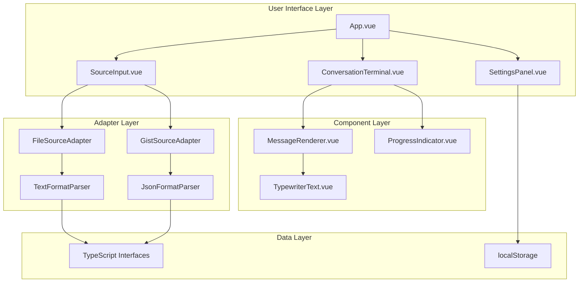
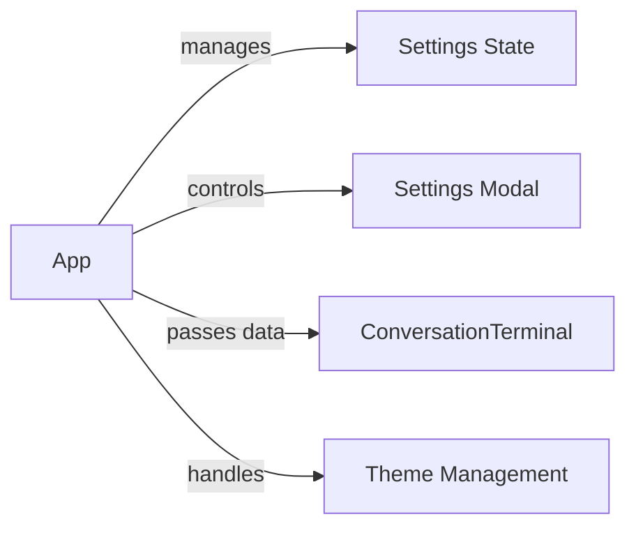
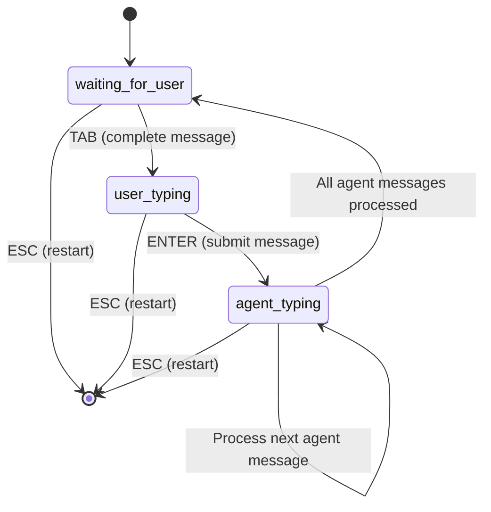
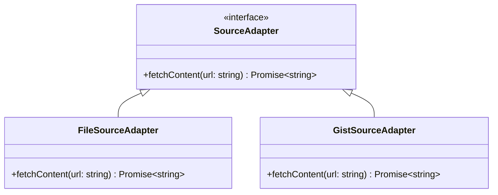
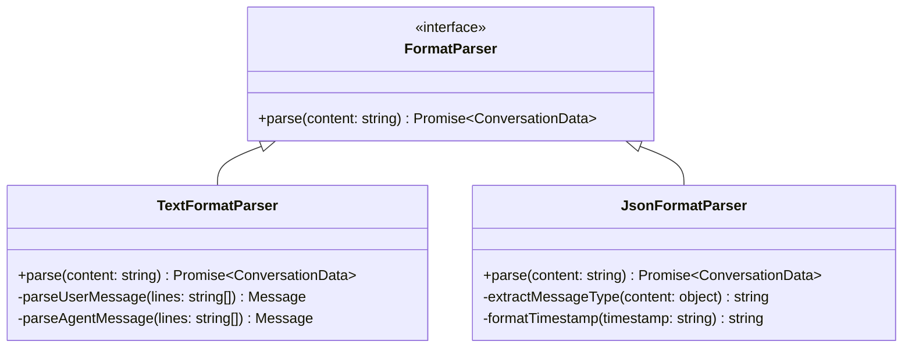
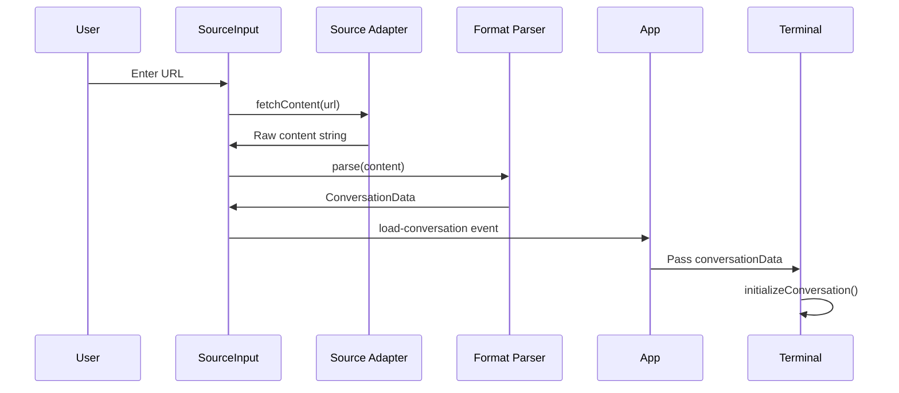
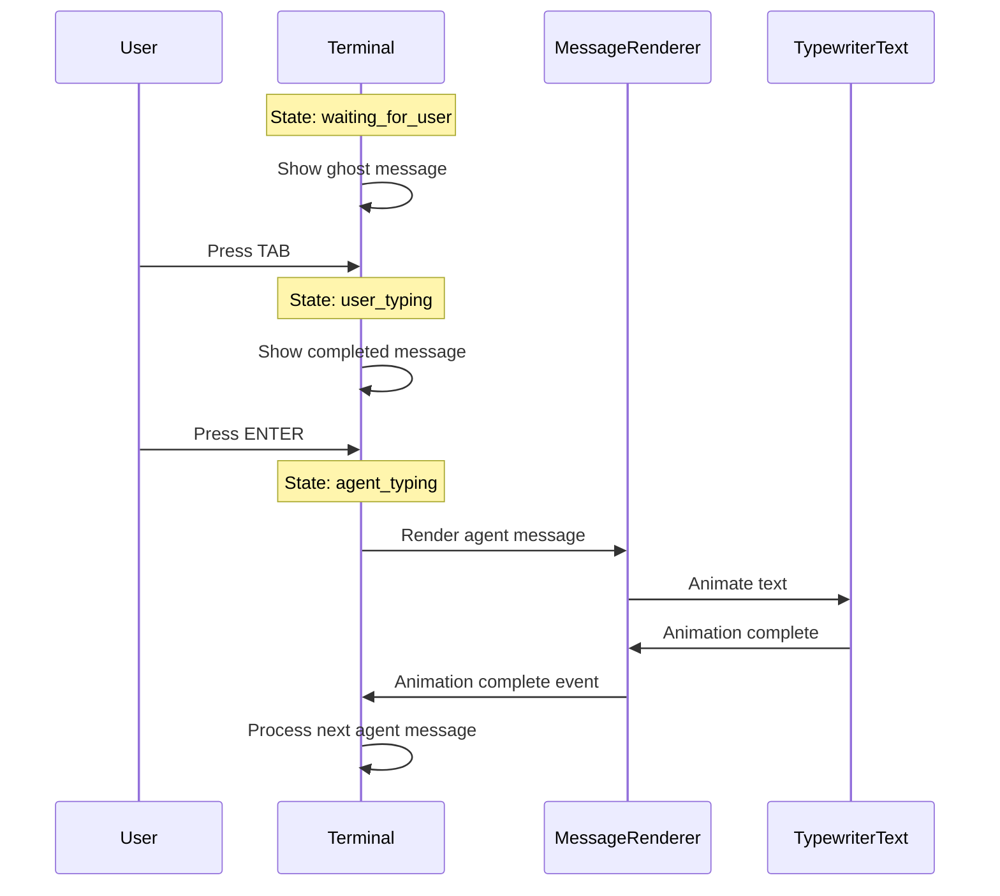
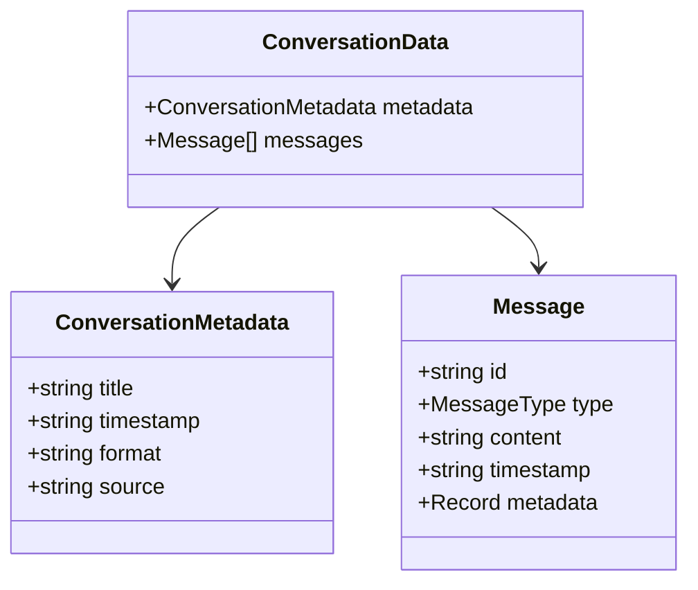

# LLM Conversation Replay Player - Architecture

This document describes the architecture of the LLM Conversation Replay Player, including component responsibilities, data flow, and interaction patterns.

## Overview

The application follows a modular Vue.js architecture with clear separation of concerns between UI components, data adapters, and business logic. The core design principle is extensibility through adapter patterns for both data sources and conversation formats.

## Architectural Principles

### Separation of Concerns
- **App Level**: Handles routing, global error/notification handling, and application-wide state
- **Conversation Level**: Manages conversation display, playback control, and contextual data visualization
- **Component Level**: Focused, reusable UI components with single responsibilities

### Responsibility Distribution
- **App.vue**: Global concerns (routing, error handling, settings persistence)
- **ConversationTerminal.vue**: Conversation-specific concerns (display, playback, context)
- **Specialized Components**: Focused functionality (message rendering, typewriter effects, context panels)

## High-Level Architecture



## Component Architecture

### Core Components

#### App.vue (Root Component)
**Responsibilities:**
- **Routing**: Navigation between home and conversation views
- **Global error/notification handling**: Provider placeholders, error boundaries
- **Settings persistence**: User preferences storage
- **Theme and dark mode handling**: Global UI state

**Key State:**
- `conversationData`: Current loaded conversation
- `settings`: User preferences
- `showSettings`: Modal dialog visibility



#### ConversationWrapper.vue (Conversation Controller)
**Responsibilities:**
- **Conversation state management**: Playback control, message progression, timing
- **Context management**: Context discovery, contextual data visualization  
- **Layout management**: Terminal and context panel coordination
- **User interaction handling**: Keyboard controls, playback state machine

#### ConversationTerminal.vue (Message Visualization)
**Responsibilities:**
- **Message rendering**: Stateless display of conversation messages
- **Typewriter effects**: Current message typing animation state only
- **Terminal UI**: Window styling, cursor display, visual formatting

**State Machine:**


**Key State:**
- `currentMessageIndex`: Position in conversation
- `conversationState`: Current state machine state
- `showCursor`: Cursor visibility control

#### MessageRenderer.vue (Individual Message Display)
**Responsibilities:**
- Render individual messages with proper styling
- Handle typewriter animation for current messages
- Display message metadata (timestamp, type)

**Props:**
- `message`: Message data
- `isCurrent`: Whether message should animate
- `settings`: Animation preferences

#### TypewriterText.vue (Text Animation)
**Responsibilities:**
- Character-by-character text animation
- Configurable animation speed
- Animation completion events

#### SourceInput.vue (Data Loading Interface)
**Responsibilities:**
- URL input handling
- Source adapter selection
- Loading state management
- Error handling

### Adapter System

#### Source Adapters
Handle different content sources with a unified interface:



#### Format Parsers
Parse different conversation formats into a unified data structure:



## Data Flow

### Loading a Conversation



### Message Playback Flow



## State Management

### Conversation State Machine

The terminal uses a finite state machine to manage conversation flow:

**States:**
- `waiting_for_user`: Showing ghost preview of next user message
- `user_typing`: User message completed but not submitted
- `agent_typing`: Processing agent responses sequentially

**Transitions:**
- TAB: `waiting_for_user` → `user_typing`
- ENTER: `user_typing` → `agent_typing`
- Agent messages complete: `agent_typing` → `waiting_for_user`
- ESC: Any state → `waiting_for_user` (restart)

### Settings Management
o
Settings are managed at the App level and persisted to localStorage:

```typescript
interface Settings {
  humanAnimationSpeed: number
  agentAnimationSpeed: number
  theme: 'matrix' | 'amber' | 'blue' | 'hacker' | 'light'
  windowStyle: 'macos' | 'linux' | 'windows'
  showProgress: boolean
  showGhostPreview: boolean
  enableSounds: boolean
}
```

## Data Models

### Core Types



### Message Types

- `human`: User input messages
- `agent`: AI assistant responses
- `tool_call`: System tool invocations
- `system`: System messages and notifications

## Extension Points

### Adding New Source Adapters

1. Implement the `SourceAdapter` interface
2. Add URL pattern detection in `SourceInput.vue`
3. Register the adapter in the selection logic

### Adding New Format Parsers

1. Implement the `FormatParser` interface
2. Add format detection logic
3. Register the parser in the parsing pipeline

### Adding New Themes

1. Add CSS custom properties in `style.css`
2. Update the `Settings` interface
3. Add theme option in `SettingsPanel.vue`

## Performance Considerations

### Animation Performance
- Typewriter animations use `requestAnimationFrame` for smooth rendering
- Message rendering is optimized with Vue's reactivity system
- Large conversations are handled efficiently through virtual scrolling concepts

### Memory Management
- Event listeners are properly cleaned up in component lifecycle
- Settings are debounced to prevent excessive localStorage writes
- Message data is kept minimal with lazy loading of metadata

## Security Considerations

### Content Loading
- URL validation prevents malicious content loading
- CORS policies are respected for external resources
- User input is sanitized before display

### Data Storage
- Settings are stored locally only
- No sensitive data is persisted
- External URLs are validated before fetching

## Testing Strategy

### Component Testing
- Unit tests for individual components
- Integration tests for adapter system
- State machine transition testing

### User Experience Testing
- Keyboard interaction testing
- Animation performance testing
- Accessibility compliance testing

## Future Architecture Considerations

### Scalability
- Plugin system for custom adapters
- WebWorker support for large conversation processing
- Streaming support for real-time conversations

### Extensibility
- Event system for custom integrations
- API for programmatic control
- Export functionality for processed conversations
